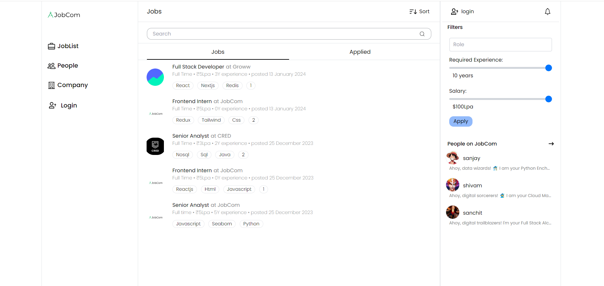

# [JobCom - Job recruitment portal](https://jobcomrecruit.vercel.app/)
Job recruiter platform that seamlessly connects job seekers and organizations.

## 👤 Job Seekers

- Create a profile for yourself.
- View, filter, search & apply for various jobs.
- View Profile of various organizations and fellow Jobcom users.
- Connect with various user by sending requests and accepting request of them

## 💼 Recruiters

- Create a profile for your organizations.
- Create job posts for jobseekers.
- View the list of applications

## Tech Stack
- Typescript
- Python
- React
- Django-rest-framework
- Postgresql
- Zustand
- Tailwind CSS

Backend Repository- [Job-Recruitment-Backend](https://github.com/dhruvsolanki0811/Job-Recruitment-Backend)
